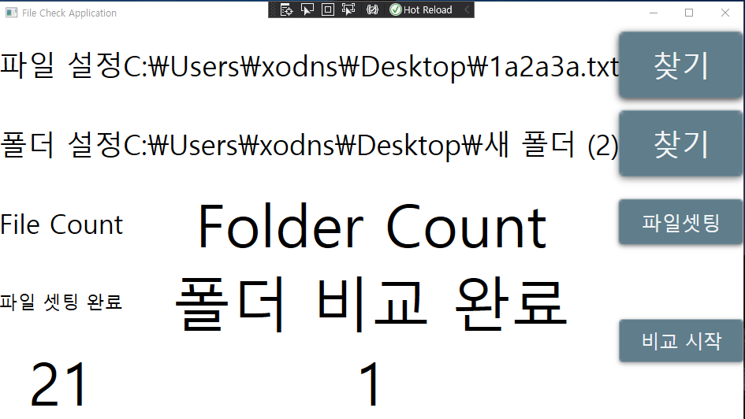

# 개발 환경

- IDE : Visual Studio 2019
- .NET Framework : 4.7.2
- UI : WPF
- Design : MaterialDesignThemes
- Framework : Prism

 

# 만든 이유

1. 어떤 폴더에 이미지가 저장이 됩니다.
2. 이미지에 대한 정보가 DB에 저장이 됩니다.
3. 이미지가 누락 되는 현상을 발견했습니다.
4. 시리얼 넘버를 가지고 이미지 파일명과 비교하여 얼마나 누락 되었는지 확인 하는 프로그램을 제작 했습니다.

 

# 사용법

1. 파일 설정의 우측 '찾기' 버튼을 눌러 txt파일을 선택 해 주세요.
    - txt파일은 시리얼넘버가 한줄에 1개만 와야 합니다.
    - 예를 들어 시리얼넘버가 10개가 있고 그이름이 1,2,3 순으로 간다면 1\r\n2\r\n3\r\n 식으로 줄바꿈으로 1Line 1SerialNumber 이어야 합니다.
2. 폴더 설정의 우측 '찾기' 버튼을 눌러 이미지가 저장 된 폴더를 지정 해 주세요.
    - 폴더 안에 있는 이미지의 파일명은 시리얼넘버를 포함하고 있어야 합니다.
    - 만약 시리얼 넘버가 '1a2a3a'라고 한다면 '1a2a3a4a'로 찾았다고 판단합니다.
    - 해당 조건에 대해서 보다 엄밀하게 조건을 걸어두지 않은 이유로는 실제 시리얼넘버는 유니크하기 때문에 그렇게 설정해두었습니다. ( 파일명에 시리얼넘버 이외의 값이 있을수도 있다고 생각하였습니다. )
3. 파일셋팅 버튼을 눌러 주세요.
    - 설정한 파일을 비교 데이터 셋으로 설정 하는 기능입니다.
    - 파일 설정할 때 알아서 셋팅이 되게할지 말지를 아직도 고민중입니다.
4. 비교 시작 버튼을 눌러 주세요.
    - 왼쪽 하단에 있는 숫자가 파일에 있는 시리얼넘버 개수 입니다.
    - 오른쪽 하단에 있는 숫자가 파일 셋팅 된 시리얼넘버에서 찾은 개수 입니다.
    - 왼쪽 숫자 - 오른쪽 숫자를 하면 이미지 누락 개수를 파악할 수 있습니다.

 
 
 

 