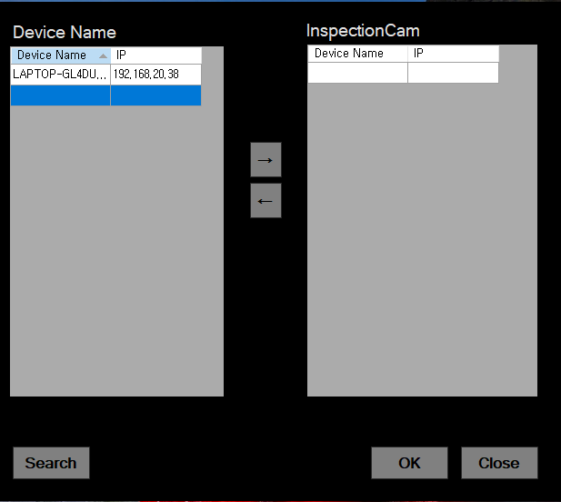
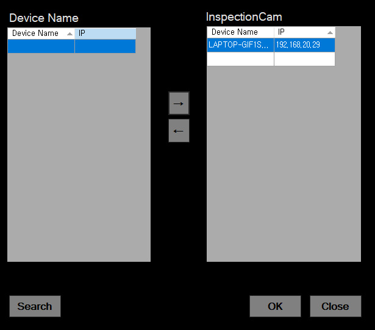
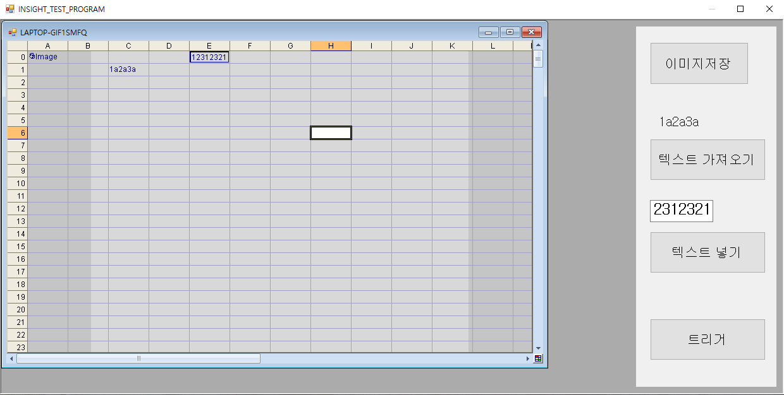

# 개발 환경

- IDE : Visual Studio 2019
- .NET Framework : 4.7.2
- UI : WinForms
- Insight SDK : 5.8.1
 
    설치 경로 : [Insight SDK 5.8.1 설치링크]("https://support.cognex.com/en/downloads/detail/in-sight/4015/1033")

 

# 만든 이유

1. Insight SDK 사용방법을 확인하기 위함입니다.
2. 셀의 데이터 가져오는 것과 셀에 데이터 넣는 방법에 대해 확인 가능합니다.
    - 유의해야 할 것은 App.config 파일에 가져올 텍스트 셀 넘버와 입력할 셀 넘버를 미리 작성 해두었습니다. 필히 App.config를 확인 바랍니다.

 

# 사용법

※ Insight SDK의 경우 5.8.1을 설치하지 않으면 안됩니다.
 
만약, 다른 버젼을 사용하고 싶으시면 설치 받은 뒤 참조를 다시 설정 해주세요.

1. Insight 에뮬레이터를 실행 해 주시고 에뮬레이터(PC/IP를 가진 Deviece가 에뮬레이터 입니다.)를 클릭하고 우측 방향 버튼을 눌러주세요
 

 

2. 오른쪽으로 이동이 되었다면 OK 버튼을 눌러 주세요.

 

 

3. 주의해야할 점은 App.config에 GET_TEXT가 C1 셀이고 SET_TEXT가 E0 셀로 미리 지정을 해두었습니다. Insight 셀에 미리 설정 해두어야 할 것이 있습니다. 
    - C1셀에 'text 로 작성해주세요 ( 앞에 '가 있으면 문자로 인식합니다. )
    - E0셀에 EditString 함수를 넣어주세요 ( Expression 관련은 구현하지 않아 EditString에 문자 넣는 것만 구현되어 있습니다.)

 

 

4. 트리거와 이미지 저장은 테스트 용도로만 확인 하시면 될 것으로 보입니다.
    - 에뮬레이터이기 때문에 정확한 결과를 얻지 못할 것입니다.
    - 이미지저장은 이미지를 어떻게 활용하면 되는지에 관한 예시로 생각하시면 됩니다.
    - 트리거는 실제 이미지가 찍혀지지 않아 확인이 어려우실텐데 Count 함수를 이용해서 트리거가 정상적으로 작동하지는지만 확인 해보시는 용도로 사용해보심이 좋을 것 같습니다.

 
 
 