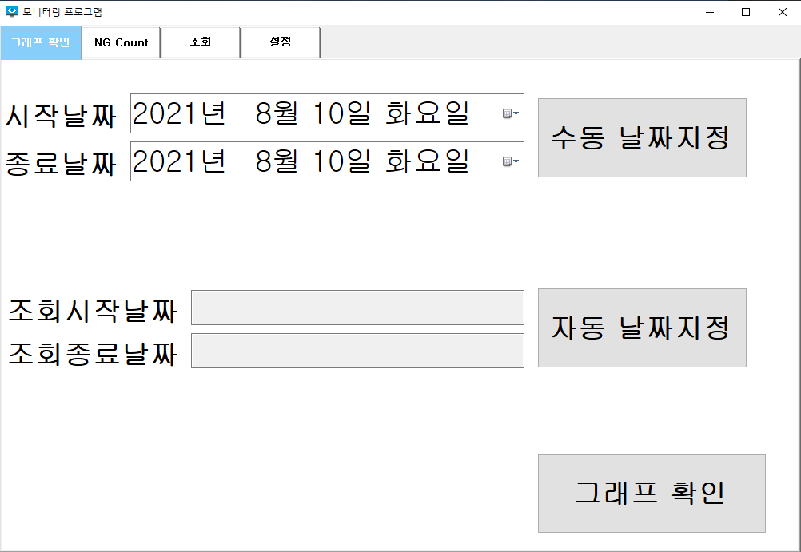
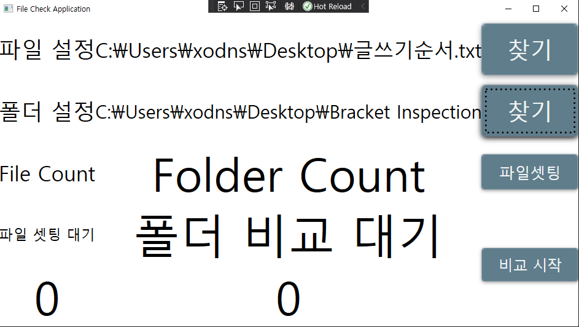
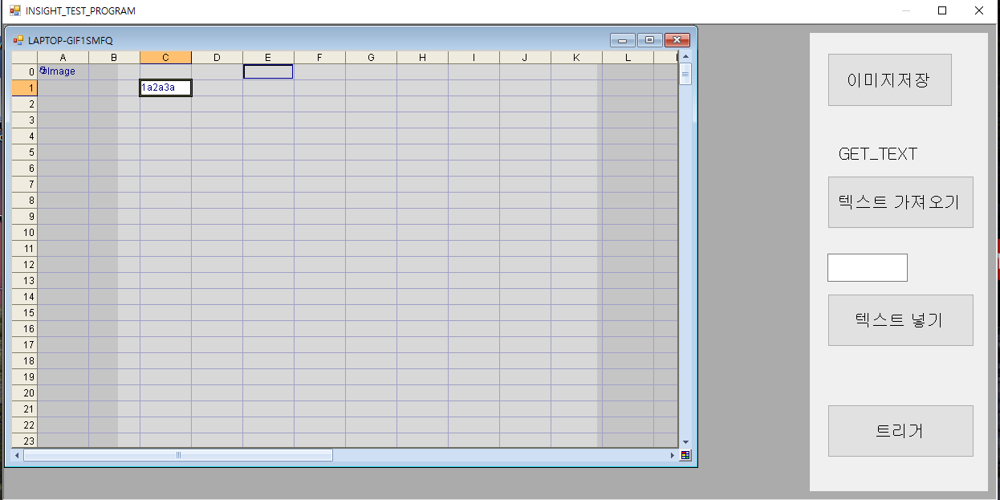
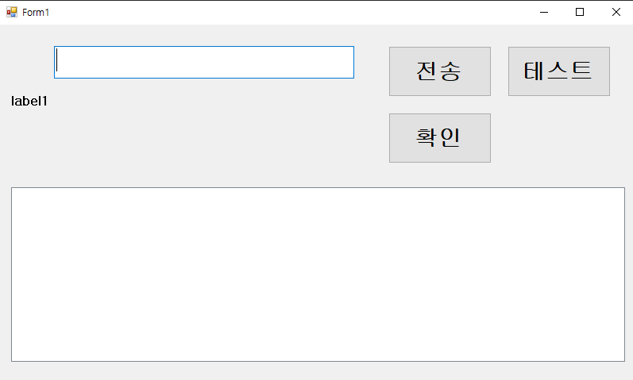
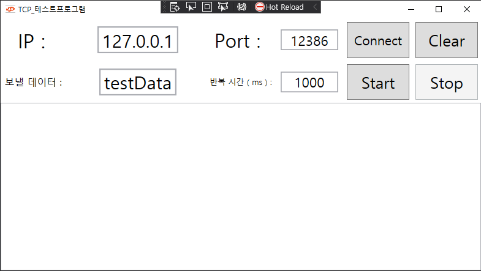

# **SHT**
  - 에스에이치텍 업무에 활용가능한 테스트 자료 모음
  - 기본적으로 Insight 카메라 연결 및 테스트, PLC 제어에 관한 자료를 모아 두었습니다.

 
 
 

# - Blade_Monitoring -
 

### 구성
1. 그래프 확인 
  - 데이터 그래프 확인 가능합니다.
2. NG Count 조회
  - 블레이드 별 NG 개수 확인 가능합니다.
3. 데이터 조회
  - 블레이드 개별 조회 또는 날짜별 조회 가능합니다.
4. 설정
  - 이미지 저장 폴더 및 데이터(CSV) 저장 폴더 확인 및 설정 가능합니다.

 

[블레이드 모니터링 자세히 보기](Blade_Monitoring\README.md)

 
 
 

# - Check Count -
 

### 구성
1. 파일 설정
  - 시리얼 넘버가 1라인씩 적혀 있는 파일 설정입니다.
2. 폴더 설정
  - 해당 폴더의 파일명을 체크할 때 사용합니다. ( 파일셋팅에서 )

3. 파일 셋팅
  - 1라인씩 읽어들여서 List에 적재  
  (ex : e0001\r\ne0002\r\n 이라면 e0001,e0002 총 두개의 시리얼 넘버가 되는 것 입니다.)

4. 비교시작
  - 파일셋팅 된 List와 폴더의 파일명을 비교하여 시리얼넘버 개수를 카운팅 합니다.   
  ( List의 값이 폴더에 파일명으로 있다면 count ++ )

  [CheckCount 자세히 보기](CheckCount\README.md)

 
 
 

# - Insight_SDK_TEST -
 

### 구성
1. 이미지 저장
  - 현재 화면을 캡처합니다. ( 원본이미지 저장은 File.FileName("image.bmp")를 저장하여야 합니다.)
2.  텍스트 가져오기
  - C1셀의 값을 가져옵니다. ( 해당 부분은 셀을 고정적으로 쓰고 있습니다. )
3. 텍스트 넣기
  - Insight의 EditString에 string 값을 넣는 기능입니다.
4. 트리거
  - 소프트웨어 트리거 1회 발생 시키는 기능입니다.

 
 
 

# - PLC_TEST -
 

> 해당 테스트는 미쯔비시 GX Works2를 설치 해야합니다.
 
> D 영역에 쓰기, 읽기 및 ASCII 또는 Binary로 포맷도 정할 수 있습니다. 
 
> 참고의 의미로만 확인 바랍니다.

 
 
 
 
 
 

# - RS232_TEST -
 

> RS232로 Serial 통신과 관련된 테스트입니다.

 
 
 
 
 
 

# - SMS_TEST -
 

### 구성
1. 메세지 전송
  - 정해진 전화번호로 메세지 전송합니다.
2. 테스트
  - 내부 파라미터들을 확인하는 용도로 사용하였습니다.
3. 확인
  - 그룹 메세지 발송에 대해서 테스트 한 내용입니다.  
  ( 그룹 발송은 어떻게하는 지 확인하지 못한채 더 이상 확인 하지 않았습니다. )

 
 
 

# - TcpClient_TEST -
 

### 구성
1. Connect
  - 적어준 IP, Port로 TCP 소켓 연결을 합니다.
2. Start
  - 보낼 데이터를 반복 시간 만큼 지속적으로 반복합니다.
3. Stop
  - 반복을 중지합니다.
