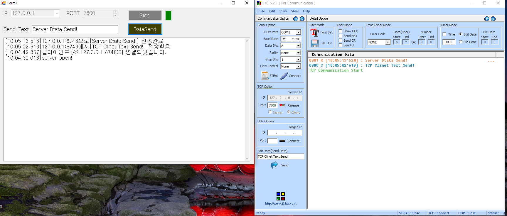

# 개발 환경

- IDE : Visual Studio 2019
- .NET Framework : 4.8
- UI : WinForms

 

# 만든 이유

1. 스마트 카메라 연결 끊김 현상을 확인하기 위해 서브로 Server 역할하는 것도 만든 것입니다.

 

# 사용법

1. IP와 Port번호를 입력하고 Start 버튼을 눌러주세요.
2. 오른쪽 색상으로 Client가 연결되었는지 아닌지 확인 가능합니다. 빨간색은 연결되지 않은 것이고 초록색은 연결되었다는 뜻입니다.
3. Client에 보내고 싶은 데이터는 Send_Text에 입력 해주세요.
4. 그 다음 DataSend를 누르면 해당 텍스트가 보내 집니다.
 

 
 
 